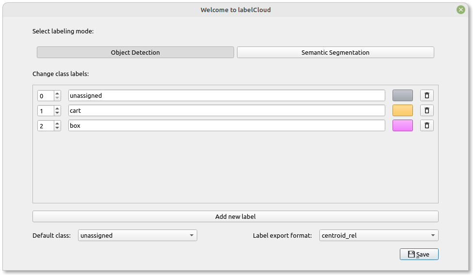

# Setup

## Installation
!!! info Python Support
    Currently labelCloud supports Python 3.7 to 3.9.

There are two options for installing labelCloud:
* Installation of the package via pip (PyPI).
* Cloning the source files from the GitHub repository.

The version in the repository tends to be newer, while the pip version is likely more stable.

### A) via pip (PyPI)

Simply install the latest version using pip.

``` sh
pip install labelCloud
labelCloud --example  # start labelCloud with example point cloud
```

The `labelCloud` command is now globally available.

### B) via git (manually)

Clone this repository and run labelCloud with Python.

```sh
git clone https://github.com/ch-sa/labelCloud.git  # 1. Clone repository
pip install -r requirements.txt  # 2. Install requirements
# 3. Copy point clouds into `pointclouds` folder.
python3 labelCloud.py  # 4. Start labelCloud
```

## Folder Structure

labelCloud expects a certain folder structure with pre-defined names.
These can be changed in the `config.ini`.


```sh
my_project/                 # project folder
├── config.ini              # project configuration
├── labels                  # label folder
│   ├── _classes.json       # label configuration (names, colors)
│   ├── pcd_01.json
│   ├── pcd_02.json
│   └── ...
└── pointclouds             # point cloud folder
    ├── pcd_01.ply
    ├── pcd_02.ply
    └── ...
```


## Label Configuration

On startup labelCloud will welcome you with a dialog to configure the most important parameters:

1. Labeling mode (default is *object detection*).
2. Label classes with their color and id (just relevant for *semantic segmentation*).
3. Default class (new bounding boxes will be added with this class).
4. Export format (the format in which the labels will be saved).



You should add here all class names that you expect to label in the point clouds.
Nevertheless, new classes can still be added while labeling. Also you can still edit their colors.

labelCloud will also automatically add classes that it finds in existing label files for you point
clouds.

This should cover the setup for most situations. If you need more adaptions, check how to configure
the software to your needs in the [Configuration](configuration.md) page.